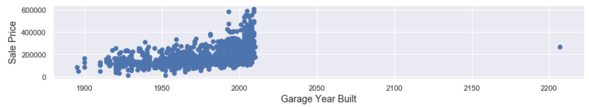

###### README.md

## Dissecting RidgeCV

<br><br>

**DSI-US-10  competition to predict housing prices in Ames, Iowa** | [kaggle.com](https://www.kaggle.com/c/dsi-us-9.9-project-2-regression-challenge/leaderboard)

---
1. [Problem Statement](#1-problem-statement)
2. [Data specs](#2-data-specs)
3. [Exploratory Data Analysis](#3-exploratory-data-analysis)
4. [Modeling](#4-modeling)
    - [Linear Regression](#linear-regression)
    - [**Ridge**](#ridge)
5. [Conclusions](#5-conclusions)

---

## 1. Problem Statement
### How does `RidgeCV` optimize Alpha?
Different train-test-split seeds result in a surprisingly wide variation of optimal alpha values estimated by the `RidgeCV` module in `sklearn`. I took this class competition as an opportunity to better understand how `RidgeCV` optimizes alpha and to explore some of the caveats of the module.

###### Background:

<details style="padding-left:20px">
<summary> What is Ridge Regression?  </summary>
<br>
Ridge regression regularizes variables in excessively complex linear models by applying an <code>l2</code> penalty to shrink coefficients:<br>
<sub>(<a href='https://towardsdatascience.com/ridge-and-lasso-regression-a-complete-guide-with-python-scikit-learn-e20e34bcbf0b' target='blank'>source</a>)</sub><br>
Lambda here (defined as alpha in <code>sklearn</code>) represents the strength of the penalty term.  With alpha set to 0, we have simple linear regression (ordinary least squares);  as alpha increases, coefficients shrink. Introducing a penalty term can help reduce overfitting from variance and multicollinearity issues.
<br><br>
</details>

<details style="margin-top:5px;padding-left:20px">
<summary> What is <code>RidgeCV</code>?  </summary>
<br>
<code>RidgeCV</code>  uses <a href='https://www.researchgate.net/publication/233801151_Generalized_Cross-Validation_as_a_Method_for_Choosing_a_Good_Ridge_Parameter' target="blank">generalized cross-validation</a> to estimate the optimal penalty strength for a Ridge regression model by searching over a range of possible alpha values and returning the best performer.
<br><br>
</details>


<details style="margin-top:5px;padding-left:20px">
<summary> What is a train-test-split?  </summary>
<br>
Splitting our data into two pieces: <code>train</code> and <code>test</code>. First we fit the model to the <code>train</code> data along with the target variable, and then we use the model predict the target variable in a new dataset, <code>test</code>, with the target variable hidden. Comparing these predictions to the true target values provides an estimate for how the model may perform on additional unfamiliar data. <b>Note:</b> The <code>train_test_split</code> module in <code>sklearn</code> accepts a <code>random_state</code> parameter for seeding the split and uses default proportions of .75 and .25 for train and test respectively.
</details>

#### Focus/goals:

- Investigate why `RidgeCV` returns such a wide variation in estimated optimal alpha values when fit to train-test-splits with different random seeds.
- Design a novel solution to optimize alpha for data with heavy outliers.
- Earn a top score in the Kaggle competition.
<br><br>

## 2. Data specs

#### Ames Iowa: Alternative to the Boston Housing Data Set

>Data set contains information from the Ames Assessor’s Office used in computing assessed values for individual residential properties sold in Ames, IA from 2006 to 2010.

[source](http://jse.amstat.org/v19n3/decock/DataDocumentation.txt) | [mirror](http://web.stanford.edu/class/stats191/data/amesdoc.txt)

||`test.csv`| `train.csv`|
|---|---|---|
|**rows**|2051|878|
|**columns**|80|81|
| X–variables|80|80|
| target (y) |0|`'SalePrice'`|


*Complete data dictionary available at [jse.amstat.org](http://jse.amstat.org/v19n3/decock/DataDocumentation.txt)*
<br><br>

## 3. Exploratory Data Analysis

<br>

First I replaced `2207` with `2007` in the `Garage Yr Blt` column. The error would not likely have had a significant impact on our model, but it can't hurt to fix.


#### Visualizing potential transformations on key X variables
A handful of independent variables contain outlier values. Considering whether to perform a log–transformation on these features or to manually adjust individual outliers, I plotted both possibilities to visualize their effects.
<br>
<br>

<br><br>
For the third row, I flattened the top one percent of values down to the 99<sup>th</sup> percentile in each category. The key question for each of these graphs is: can we draw a straight line to describe the overall trend?
<br>

#### Imputation

To perform linear regression, our data must be free of missing or N/A values. Luckily, most of the missing values in this dataset indicate that a house simply does not have that feature (`Fireplace Quality`, for example). Based on this assumption I replaced all missing values with `0`, except in `Garage Yr Blt` where I replaced missing values with the `Year Built` of the house.

###### For more EDA, cleaning and feature engineering see:

- [`/code/EDA-cleaning-engineering.ipynb`](/code/EDA-cleaning-engineering.ipynb)
<br><br>

## 4. Modeling

### Linear Regression
Before modeling with `Ridge` I evaluated the performance of a linear regression model with no penalty terms. The competition used root mean squared error (RMSE) scoring, which measures the average distance of predictions from true values. I used the same metric to evaluate this model.

#### Instantiate, fit and score:
```
ols = LinearRegression()
ols.fit(X_train, y_train)
cross_val_score(ols, X_test, y_train, cv=5)
> 0.8640180457451123 # CROSS VAL SCORE
np.sqrt(mean_squared_error(y_test, y_pred))
> 23394.014667540003 # RMSE
```
Predictions from this model yielded an RMSE score of 24,538 on Kaggle, slightly worse than `sklearn`'s estimate of 23,394  (residuals in blue below). In orange, the same model with a log-transformation on the target variable for a moderate reduction in losses (5-fold cross-vali  +0.5%).

#### Residuals:

<br>
Each dot's distance from the center dotted line on this scatterplot corresponds to the magnitude of error for each of the model's predictions.
<br><br>

### Ridge

Fitting `RidgeCV` over a series of train-test-splits with unique random seeds results in a wide variation of optimal alpha values. The following graph highlights two primary clusters of train-test-split seeds, the first with an optima alpha under somewhere 100 and the second with an optimal alpha somewhere above 1,000.

**Test R<sup>2</sup> scores across a linear alpha range:**


The splits with lower scores most likely contain a disproportionate ratio of outliers between train and test, leading `RidgeCV` to suggest a stronger penalty term to reduce the strength of the specific X-variables with skewed outliers.<br><br>

#### Estimating alpha with `RidgeCV`
Given a range of possible values, `RidgeCV` optimizes alpha by scoring each model with [generalized cross-validation](http://pages.stat.wisc.edu/~wahba/stat860public/pdf1/golub.heath.wahba.pdf), using a similar principle to scoring test data from default .75/.25 train-test-splita. In `RidgeCV`, it is customary to search for alpha over a logarithmic scale.

<div style="text-align:center"><h6>logspace(.1, 3, 100):</h6></div><br>

In these charts, I use a linear scale to smooth the test score lines. Three optimal alpha values, each associated with a unique train-test-split random seed, are highlighted to demonstrate the wide range of potential optimization.
<br><br>

#### Optimal alpha distribution over `logspace(1,3.5,100)`

Finally, I used a `for` loop and `RidgeCV` with a range of train-test-split seeds to plot the distribution of optimal alpha values across 500 unique splits:

```
alphas = []
for tt_split in range(1000):
    X_train, X_test, y_train, y_test = train_test_split(X, y,
      random_state=tt_split)
    ridgecv = RidgeCV(alphas=np.logspace(1,3.5,100), cv=5)
    ridgecv.fit(X_train, y_train)
    alpha = ridgecv.alpha_
    alphas.append(alpha)
```
<div ><h6 style="text-align:center">Distribution of optimal alphas:</h6></div>

With a relatively small dataset it is difficult to qualify true outliers. Sticking with a lower alpha value should maintain the strength of weaker variables that may be important to calculating predictions in test data. I set alpha to 80 for my final predictions because greater values would risk over-penalizing 
<br><br>

## 5. Conclusions

Predictions with Ridge Regression (`alpha=80`) yielded an RMSE of 20,781 on Kaggle, earning the model 8<sup>th</sup> place out of 123 national participants in the final standings. In the future I want to dissect the specific train-test-splits where alpha optimized at higher values to identify the features or rows containing outliers. The following plot ignores outlier splits to highlight where a majority of split seeds optimize alpha, explaining why I settled on a lower value:


### Big picture:
Alpha optimization in `RidgeCV` can vary widely when fitting a model over different train-test-splits of the same data. While computationally expensive, iterating over many train-test-split random seeds to plot the distribution of optimal `Ridge` alphas provided clarity with regard to the wide variance in optimization and helped in deciding what penalty strength to use in final predictions.

---

###### Further reading:
- "Ridge Regression for Better Usage"
 ([Kyoosik Kim, 2019](https://towardsdatascience.com/ridge-regression-for-better-usage-2f19b3a202db))

- "Generalized Cross-Validation as a Method for Choosing a Good Ridge Parameter" ([*Technometrics*, 1979](http://pages.stat.wisc.edu/~wahba/stat860public/pdf1/golub.heath.wahba.pdf))

---

###### Directory structure:

```
.|-code
    |-EDA-cleaning-engineering.ipynb
    |-modeling-with-ridge.ipynb
    |- •••
 |—datasets
    |-train.csv
    |-test.csv
    |- •••
 |—README.md
 |-Visuals

```
